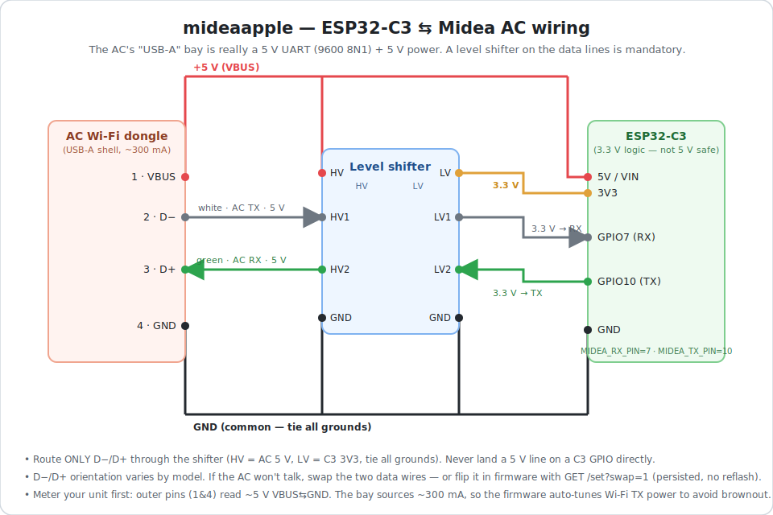

# mideaapple

[](https://github.com/Sewci0/mideaapple/actions/workflows/build.yml)

Native **HomeKit** firmware for a Midea air conditioner, running directly on an
**ESP32-C3** — no Home Assistant, no ESPHome, no Pi bridge. The AC appears in the
Apple Home app on its own.

It replaces the ESPHome `midea` setup with two libraries:

| Layer        | Library                | Job                                            |
|--------------|------------------------|------------------------------------------------|
| HomeKit      | [HomeSpan](https://github.com/HomeSpan/HomeSpan) | HAP pairing, mDNS, the `HeaterCooler` service |
| AC protocol  | [dudanov/MideaUART](https://github.com/dudanov/MideaUART) | the UART frames ESPHome's `midea` component wraps |

`src/MideaHeaterCooler.h` is the glue: HomeKit characteristics ⇄ Midea state.

## Will it work with my AC? (Midea family & rebadges)

MideaUART speaks the protocol shared across Midea Group's own brands **and** the
many third-party ACs Midea OEM-manufactures. If your unit has the UART "WiFi
dongle" bay (and isn't IR-only), it's likely compatible — though per-model
support varies, and some newer units use a different protocol.

**Midea Group brands** (owned/sister brands): **Midea**, **COLMO**, **Toshiba**
(home-appliance division), **Comfee'**, **WAHIN / Hualing**, **Little Swan**,
**Bugu**, **Clivet**, **Eureka**. (Plus non-appliance arms: KUKA robotics,
GMCC & Welling compressors/motors.)

**Rebadged / OEM-compatible brands** (same Midea UART protocol — non-exhaustive):
ActronAir, Airfel, Alpine, Artel, Ballu, Beko, Bluestar, Bosch, Bryant, Carrier,
Danby, Electrolux, Idea, Inventor, Kaisai, KeepRite, Kentatsu, Keystone, KoolKing,
Lennox, MaxiCool, Mirage, Mitsui, Mr.Cool, Neoclima, Nippon, Olimpia Splendid,
Olmo, Pioneer, Pitsos, Qlima, Remko, Rotenso, RoyalClima, Senville, Simando,
Vestfrost, Zanussi.

Sources: [Midea Group brand portfolio](https://en.wikipedia.org/wiki/Midea_Group) ·
[SLWF-01 compatible-brand list](https://smlight.tech/product/slwf-01) ·
[ESPHome known-working models thread](https://community.home-assistant.io/t/midea-a-c-and-esphome-component-list-of-all-known-working-models-and-manufacturers/320784)

## The AC's "USB" port (⚠ read before plugging anything in)

The dongle bay looks like a USB-A port, but on Midea ACs it is **not real USB** —
it's the WiFi-dongle interface: **5 V power on VBUS and a 5 V TTL UART (9600 8N1)
on the data pins.** The UART is **5 V logic** (per the ESPHome midea docs — it
"does not appear to work with 3.3 V"), and ESP32-C3 GPIOs are **not 5 V tolerant**,
so a **level shifter on the data lines is mandatory**.



Typical USB-A pinout (⚠ still meter your specific unit to confirm):

```
USB-A pin (wire)   signal            ESP32-C3
  1 VBUS  (red)    +5 V              5V / VIN    (powers the board)
  2 D-    (white)  AC TX, 5V TTL --> GPIO7  (RX)  MIDEA_RX_PIN   via shifter
  3 D+    (green)  AC RX, 5V TTL <-- GPIO10 (TX)  MIDEA_TX_PIN   via shifter
  4 GND   (black)  GND               GND
```

Outer two pins = power (VBUS + GND); inner two = the UART (D-/D+). The
D- = AC-TX / D+ = AC-RX mapping is the documented one for Midea/MrCool USB units,
but orientation varies by model — if it doesn't talk, flip the **UART pins**
toggle via the API (runtime swap, persisted, no reflash — `GET /set?swap=1`) or
physically swap D-/D+. Route both data lines through the level shifter (HV = AC 5 V,
LV = C3 3V3, common GND) — **never** land a 5 V line on a C3 GPIO directly. Meter
first: the two outer pins read ~5 V (VBUS↔GND). Some models use a 4-pin JST-XH
header instead of USB-A. (Pinout per the ESPHome midea docs + MrCool teardown.)

GPIO7/10 are the defaults (set in `platformio.ini` as `MIDEA_RX_PIN` /
`MIDEA_TX_PIN`); both are safe general-purpose pins — clear of the strapping pins
(2/8/9), the USB-JTAG pair (18/19), and the console UART0 (20/21).

### Power — the 300 mA limit & WiFi TX auto-tuning

That port only sources ~**300 mA**, and a full-power WiFi transmit (peaks toward
~500 mA) can sag the rail and corrupt the association handshake. On a brownout-prone
C3 the symptom is subtle: it **fails to authenticate, especially to a strong/near
AP** (`reason 2` in the serial log), while a weak/far AP still works.

The firmware handles this **automatically** — on first boot it auto-tunes WiFi TX
power: it tries each level (19.5 → 2 dBm), measures the resulting link, and keeps
the one with the **strongest RSSI** (so it lands on the best AP, not just any AP),
preferring the highest power among equally-good links. The winner is saved to NVS
for fast reboots; re-search happens automatically if it ever stops connecting. The
current level is shown in `GET /state` as `"tx"`.

Why "strongest link" and not "highest power": on a weak board, higher TX can fail
the good AP and get shoved onto a worse one, so naive "highest power that connects"
is wrong. (ESPHome/most libs only expose a *manual* `output_power` value; this
searches for the right one per board + install.)

If you want more range headroom (e.g. to run higher TX power), solder a **≥470 µF
electrolytic across 5V→GND** to absorb the transients, or feed the board from a
stronger 5 V source — then it'll auto-tune to a higher level on its own. The BLE
radio is also shut off at boot (`btStop()`, HomeSpan is WiFi-only) to free a little
more current on the tight rail.

## Build & flash

PlatformIO lives in a dedicated venv (Homebrew's Python is PEP-668
externally-managed, so `pip --user` is blocked; use python3.13, not broken 3.14):

```sh
# one-time
python3.13 -m venv ~/.venvs/pio
~/.venvs/pio/bin/pip install -U platformio
alias pio=~/.venvs/pio/bin/pio        # optional convenience

cd ~/projects/mideaapple
~/.venvs/pio/bin/pio run              # compile (also fetches HomeSpan + MideaUART)
~/.venvs/pio/bin/pio run -t upload    # flash over the C3's USB-C (bench)
~/.venvs/pio/bin/pio device monitor   # serial log @115200
```

**Toolchain notes:**
- **Apple Silicon Macs:** the ESP32 RISC-V toolchain is an x86_64 binary — install
  Rosetta 2 once (`softwareupdate --install-rosetta --agree-to-license`) or the
  build fails with `riscv32-esp-elf-g++: Bad CPU type in executable`.
- **Platform** (`platformio.ini`): the [pioarduino](https://github.com/pioarduino/platform-espressif32)
  community fork of `platform-espressif32`, which ships **arduino-esp32 core 3.x**
  (ESP-IDF 5.x). That core is what **HomeSpan 2.x** requires — its per-service
  `ConfiguredName` support is what lets us name every tile inside one grouped AC
  device. `platform = .../stable/...` tracks the latest; pin a versioned release
  URL for reproducible builds.
- **Flaky USB flashing?** The C3's native USB-JTAG can drop mid-flash if a serial
  monitor holds the port — close the monitor first, then re-run `pio run -t upload`.

## Pair with HomeKit

1. First boot has no WiFi — provision it: in the serial monitor type `W` and
   follow HomeSpan's prompt (or use its temporary setup hotspot).
2. Home app → **Add Accessory** → **More options** → enter code **466-37-726**
   (HomeSpan's default; change it with the `S` serial command).

Everything lands under **one** "Midea AC" device (HomeSpan 2.x names each service
in place with `ConfiguredName`, so tiles read correctly instead of all showing
"Midea AC" — no bridge, no scatter of separate accessories). Its tiles:

| Tile | Service | Covers |
|------|---------|--------|
| Midea AC   | `HeaterCooler`      | power, Auto/Heat/Cool, target temp, fan speed (low/med/high), swing |
| Outdoor    | `TemperatureSensor` | the AC's outdoor-coil temperature |
| Fan Only   | `Switch`            | Midea's fan-only mode (no HeaterCooler equivalent) |
| Dry        | `Switch`            | Midea's dehumidify mode |
| Fan Auto   | `Switch`            | fan **Auto** (the speed slider can't express it); power-gated so it reads off when the AC is off |

The onboard RGB LED (GPIO8) shows HomeSpan status at a glance — blinking while it
searches for WiFi / waits to be paired, steady once it's connected and paired.

> **Upgraded from an earlier build?** The HomeSpan 2.x migration changes the
> accessory identity — remove the old "Midea AC" from Home and re-add it with the
> pairing code above.

## Update over the air (OTA)

After the first USB flash, updates can go over WiFi (`enableOTA()` in `main.cpp`,
default password `homespan-ota`). Grab the device IP from the serial log, then:

```sh
~/.venvs/pio/bin/pio run -e ota -t upload --upload-port 192.168.x.y
```

Change the OTA password with the `O` serial command, or hardcode it via
`enableOTA("your-password")`.

## Web control panel

Besides HomeKit, the firmware serves a small control page on **port 80**
(`src/WebUI.h`). HomeKit's HAP server is moved to **:1201** so the panel can own
the default port — HomeKit still finds it via mDNS. After it joins WiFi it prints
its address to the serial log:

```
Web UI: http://192.168.x.y/
```

The page shows indoor/outdoor temp and controls power, mode (incl. Dry/Fan that
HomeKit's HeaterCooler can't show), target temp, fan, and swing. It writes to the
same `AirConditioner` object HomeKit uses, so the Home app, the web page, and the
AC's own remote stay in sync. While the AC is off it still shows the **last mode**
(power *is* the mode in MideaUART, so the AC forgets it otherwise), and the fan and
swing controls disable — those settings only apply while it's running. Endpoints (HTTP, unauthenticated — LAN only):

- `GET /state` — JSON: AC state **plus** the WiFi link (`bssid`, `rssi`, `chan`,
  the auto-tuned `tx` power, and the `swap` state).
- `GET /set?<k>=<v>` — apply a change (`power,temp,mode,fan,swing,swap`).
- `GET /scan` — every visible AP (SSID/BSSID/channel/RSSI as the chip hears it) —
  handy for seeing which AP/BSSID it can actually reach.

The runtime **UART RX/TX pin swap** is exposed through the API only
(`GET /set?swap=1`, persisted across reboots — flip it if the AC doesn't respond);
it's deliberately kept out of the GUI to avoid an accidental tap breaking comms.

## Troubleshooting

**Serial commands** (type `?` in the monitor for the full HomeSpan menu):

| Key | Action |
|-----|--------|
| `W` / `X` | set / erase WiFi credentials |
| `S` | change the HomeKit pairing code |
| `O` | change the OTA password |
| `U` | unpair (delete all HomeKit controllers) |
| `H` | delete pairing data + device ID |
| `F` / `R` | factory reset / reboot |

**Other issues:**
- **Won't enter flashing mode:** hold `BOOT`, tap `RST`, release `BOOT`, retry.
- **AC doesn't respond:** swap RX/TX at runtime with `GET /set?swap=1` — it
  persists across reboots, no reflash. (Orientation varies by model.) Also confirm
  the level shifter is powered on both rails (HV = AC 5 V, LV = C3 3V3, common GND).
- **Random reboots, or won't join a strong/near AP (`reason 2`):** brown-out on
  the 300 mA rail when transmitting at full power. The firmware **auto-tunes TX
  power** to dodge this (watch the `[tx-tune]` serial log at boot); for more range
  headroom add a ≥470 µF bulk cap and/or a stronger 5 V supply.

## Status / TODO

- [x] Board: ESP32-C3 (small + low avg draw for the 300 mA bay).
- [x] Firmware builds green on arduino-esp32 core 3.x / HomeSpan 2.x.
- [x] Wired to a real AC on GPIO7/10 (via level shifter) — indoor/outdoor temps
      and controls confirmed working end-to-end.
- [x] HomeKit: one grouped "Midea AC" device with named tiles — HeaterCooler,
      Outdoor temp, Fan Only, Dry, Fan Auto (each a `ConfiguredName`d service).
- [x] Dry / Fan-only modes exposed via the web UI too (HeaterCooler can't show them).
- [x] WiFi TX-power auto-tuning (dodges the 300 mA-rail brownout; picks the
      strongest-link level, no per-board hardcoding) + onboard status LED (GPIO8).
- [x] Optimistic web-UI + HomeKit mirroring (hold-until-confirmed + debounce) so
      buttons don't snap back mid-transition.
- [ ] Confirm compatibility on more AC models (UART dongle bay, not IR-only).
- [ ] Optional: ≥470 µF bulk cap for more TX-power/range headroom (auto-tune
      already handles the brownout without it).

## Credits & license

`mideaapple` is MIT-licensed — see [LICENSE](LICENSE). It's the glue between two
MIT-licensed libraries that do all the real protocol/HAP work:

- **[HomeSpan](https://github.com/HomeSpan/HomeSpan)** — HomeKit Accessory
  Protocol for the Arduino-ESP32, © Gregg E. Berman.
- **[dudanov/MideaUART](https://github.com/dudanov/MideaUART)** — the Midea UART
  protocol (also the basis of ESPHome's `midea` component), © Sergey Dudanov.
